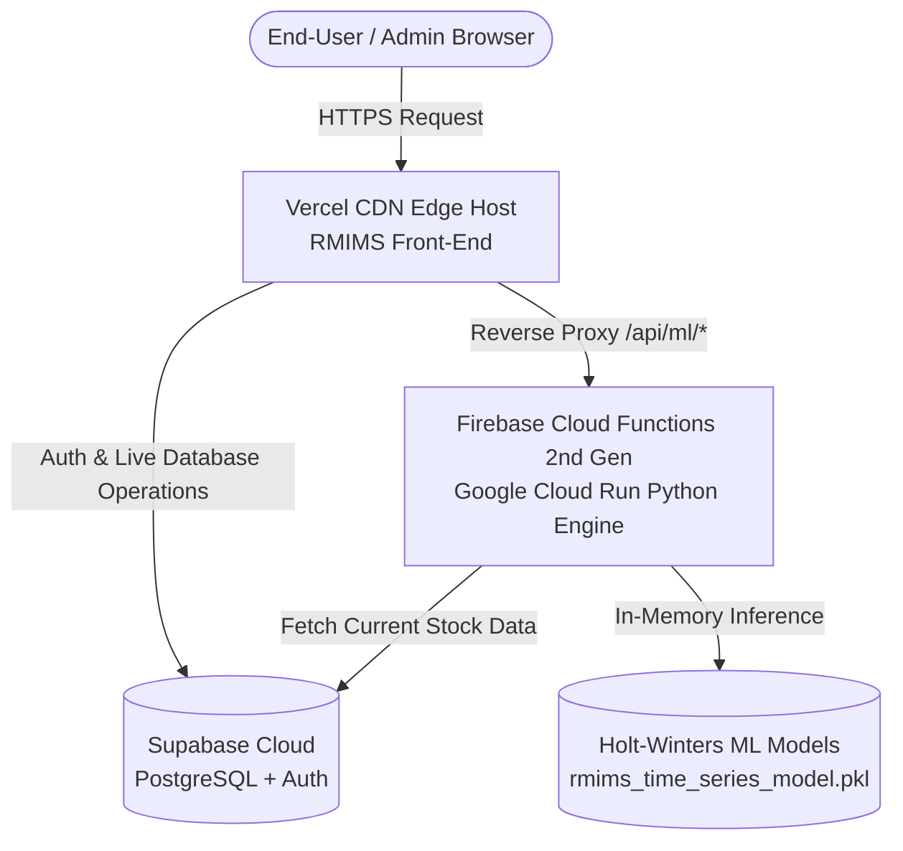

# RMIMS: Comprehensive System Audit & Cloud Deployment Blueprint (Firebase ML Edition)

---

## 1. Executive Summary & System Deployment Status

| System Component | Technology Stack | Local / Operational Status | Cloud Deployment Target |
| :--- | :--- | :--- | :--- |
| **Front-End Website** | Vanilla ES6 Modules, Vite 6.2, HTML5, CSS3, Chart.js | **Healthy & Verified** (Bundles in ~1.0s via `npm run build`) | **Vercel** (`https://rmims-system.vercel.app`) |
| **Database & Auth** | Supabase Cloud (PostgreSQL, Row Level Security, Auth, Edge Functions) | **Live & Connected** (`hgandqozgcpytxebhvtn.supabase.co`) | **Supabase Cloud** |
| **ML Backend API** | Python Flask, WSGI, `supabase-py` REST API | **Healthy** (All endpoints return HTTP 200) | **Firebase Cloud Functions (2nd Gen Python)** |
| **ML Models** | Holt-Winters Exponential Smoothing (`rmims_time_series_model.pkl`, 3.68 MB) | **Trained & Verified** (27 materials + `OVERALL_TOTAL`) | **Firebase Cloud Functions In-Memory Container** |

---

## 2. In-Depth Component Audit

### 2.1. Front-End Website (RMIMS UI & Portals)
- **Framework & Bundler**: Vite 6.2 Multi-Page Application (MPA) written in pure ES6 JavaScript and Vanilla CSS.
- **Entry Points & Active Pages**:
  - **Public & Authentication**:
    - Landing page: [RMIMS/index.html](file:///c:/Users/Zeanna/Downloads/RMIMS-AI-BASED-FORECASTING-INTEGRATED/RMIMS-DASHBOARD-VIEW-3D-SUGAR-APPLIED/RMIMS-Supabase-ML-Forecasting-Integration/RMIMS/index.html)
    - Administrator login: [RMIMS/login.html](file:///c:/Users/Zeanna/Downloads/RMIMS-AI-BASED-FORECASTING-INTEGRATED/RMIMS-DASHBOARD-VIEW-3D-SUGAR-APPLIED/RMIMS-Supabase-ML-Forecasting-Integration/RMIMS/login.html)
    - User sign-in: [RMIMS/user-signin.html](file:///c:/Users/Zeanna/Downloads/RMIMS-AI-BASED-FORECASTING-INTEGRATED/RMIMS-DASHBOARD-VIEW-3D-SUGAR-APPLIED/RMIMS-Supabase-ML-Forecasting-Integration/RMIMS/user-signin.html)
    - Portal directory: [RMIMS/portal.html](file:///c:/Users/Zeanna/Downloads/RMIMS-AI-BASED-FORECASTING-INTEGRATED/RMIMS-DASHBOARD-VIEW-3D-SUGAR-APPLIED/RMIMS-Supabase-ML-Forecasting-Integration/RMIMS/portal.html)
  - **Admin Suite (7 Modules)**:
    - [RMIMS/admin/dashboard.html](file:///c:/Users/Zeanna/Downloads/RMIMS-AI-BASED-FORECASTING-INTEGRATED/RMIMS-DASHBOARD-VIEW-3D-SUGAR-APPLIED/RMIMS-Supabase-ML-Forecasting-Integration/RMIMS/admin/dashboard.html) & [RMIMS/js/dashboard.js](file:///c:/Users/Zeanna/Downloads/RMIMS-AI-BASED-FORECASTING-INTEGRATED/RMIMS-DASHBOARD-VIEW-3D-SUGAR-APPLIED/RMIMS-Supabase-ML-Forecasting-Integration/RMIMS/js/dashboard.js)
    - [RMIMS/admin/forecasting.html](file:///c:/Users/Zeanna/Downloads/RMIMS-AI-BASED-FORECASTING-INTEGRATED/RMIMS-DASHBOARD-VIEW-3D-SUGAR-APPLIED/RMIMS-Supabase-ML-Forecasting-Integration/RMIMS/admin/forecasting.html) & [RMIMS/js/forecasting.js](file:///c:/Users/Zeanna/Downloads/RMIMS-AI-BASED-FORECASTING-INTEGRATED/RMIMS-DASHBOARD-VIEW-3D-SUGAR-APPLIED/RMIMS-Supabase-ML-Forecasting-Integration/RMIMS/js/forecasting.js)
    - [RMIMS/admin/inventory.html](file:///c:/Users/Zeanna/Downloads/RMIMS-AI-BASED-FORECASTING-INTEGRATED/RMIMS-DASHBOARD-VIEW-3D-SUGAR-APPLIED/RMIMS-Supabase-ML-Forecasting-Integration/RMIMS/admin/inventory.html) & [RMIMS/js/inventory.js](file:///c:/Users/Zeanna/Downloads/RMIMS-AI-BASED-FORECASTING-INTEGRATED/RMIMS-DASHBOARD-VIEW-3D-SUGAR-APPLIED/RMIMS-Supabase-ML-Forecasting-Integration/RMIMS/js/inventory.js)
    - [RMIMS/admin/material-activity.html](file:///c:/Users/Zeanna/Downloads/RMIMS-AI-BASED-FORECASTING-INTEGRATED/RMIMS-DASHBOARD-VIEW-3D-SUGAR-APPLIED/RMIMS-Supabase-ML-Forecasting-Integration/RMIMS/admin/material-activity.html) & [RMIMS/js/material-activity-admin.js](file:///c:/Users/Zeanna/Downloads/RMIMS-AI-BASED-FORECASTING-INTEGRATED/RMIMS-DASHBOARD-VIEW-3D-SUGAR-APPLIED/RMIMS-Supabase-ML-Forecasting-Integration/RMIMS/js/material-activity-admin.js)
    - [RMIMS/admin/analytics.html](file:///c:/Users/Zeanna/Downloads/RMIMS-AI-BASED-FORECASTING-INTEGRATED/RMIMS-DASHBOARD-VIEW-3D-SUGAR-APPLIED/RMIMS-Supabase-ML-Forecasting-Integration/RMIMS/admin/analytics.html) & [RMIMS/js/analytics.js](file:///c:/Users/Zeanna/Downloads/RMIMS-AI-BASED-FORECASTING-INTEGRATED/RMIMS-DASHBOARD-VIEW-3D-SUGAR-APPLIED/RMIMS-Supabase-ML-Forecasting-Integration/RMIMS/js/analytics.js)
    - [RMIMS/admin/reports.html](file:///c:/Users/Zeanna/Downloads/RMIMS-AI-BASED-FORECASTING-INTEGRATED/RMIMS-DASHBOARD-VIEW-3D-SUGAR-APPLIED/RMIMS-Supabase-ML-Forecasting-Integration/RMIMS/admin/reports.html) & [RMIMS/js/reports.js](file:///c:/Users/Zeanna/Downloads/RMIMS-AI-BASED-FORECASTING-INTEGRATED/RMIMS-DASHBOARD-VIEW-3D-SUGAR-APPLIED/RMIMS-Supabase-ML-Forecasting-Integration/RMIMS/js/reports.js)
    - [RMIMS/admin/settings.html](file:///c:/Users/Zeanna/Downloads/RMIMS-AI-BASED-FORECASTING-INTEGRATED/RMIMS-DASHBOARD-VIEW-3D-SUGAR-APPLIED/RMIMS-Supabase-ML-Forecasting-Integration/RMIMS/admin/settings.html) & [RMIMS/js/settings.js](file:///c:/Users/Zeanna/Downloads/RMIMS-AI-BASED-FORECASTING-INTEGRATED/RMIMS-DASHBOARD-VIEW-3D-SUGAR-APPLIED/RMIMS-Supabase-ML-Forecasting-Integration/RMIMS/js/settings.js)
    - [RMIMS/admin/user-management.html](file:///c:/Users/Zeanna/Downloads/RMIMS-AI-BASED-FORECASTING-INTEGRATED/RMIMS-DASHBOARD-VIEW-3D-SUGAR-APPLIED/RMIMS-Supabase-ML-Forecasting-Integration/RMIMS/admin/user-management.html) & [RMIMS/js/user-management.js](file:///c:/Users/Zeanna/Downloads/RMIMS-AI-BASED-FORECASTING-INTEGRATED/RMIMS-DASHBOARD-VIEW-3D-SUGAR-APPLIED/RMIMS-Supabase-ML-Forecasting-Integration/RMIMS/js/user-management.js)
  - **User Suite (6 Modules)**:
    - [RMIMS/user/dashboard.html](file:///c:/Users/Zeanna/Downloads/RMIMS-AI-BASED-FORECASTING-INTEGRATED/RMIMS-DASHBOARD-VIEW-3D-SUGAR-APPLIED/RMIMS-Supabase-ML-Forecasting-Integration/RMIMS/user/dashboard.html), [RMIMS/user/inventory.html](file:///c:/Users/Zeanna/Downloads/RMIMS-AI-BASED-FORECASTING-INTEGRATED/RMIMS-DASHBOARD-VIEW-3D-SUGAR-APPLIED/RMIMS-Supabase-ML-Forecasting-Integration/RMIMS/user/inventory.html), [RMIMS/user/material-activity.html](file:///c:/Users/Zeanna/Downloads/RMIMS-AI-BASED-FORECASTING-INTEGRATED/RMIMS-DASHBOARD-VIEW-3D-SUGAR-APPLIED/RMIMS-Supabase-ML-Forecasting-Integration/RMIMS/user/material-activity.html), [RMIMS/user/analytics.html](file:///c:/Users/Zeanna/Downloads/RMIMS-AI-BASED-FORECASTING-INTEGRATED/RMIMS-DASHBOARD-VIEW-3D-SUGAR-APPLIED/RMIMS-Supabase-ML-Forecasting-Integration/RMIMS/user/analytics.html), [RMIMS/user/reports.html](file:///c:/Users/Zeanna/Downloads/RMIMS-AI-BASED-FORECASTING-INTEGRATED/RMIMS-DASHBOARD-VIEW-3D-SUGAR-APPLIED/RMIMS-Supabase-ML-Forecasting-Integration/RMIMS/user/reports.html), [RMIMS/user/settings.html](file:///c:/Users/Zeanna/Downloads/RMIMS-AI-BASED-FORECASTING-INTEGRATED/RMIMS-DASHBOARD-VIEW-3D-SUGAR-APPLIED/RMIMS-Supabase-ML-Forecasting-Integration/RMIMS/user/settings.html).
- **Communication Layer**:
  - Direct database access through `@supabase/supabase-js` v2 CDN with persistent session authentication.
  - Dynamically resolves ML backend base URL via `getApiBase()`: checks relative `/api/ml/status`, falls back to local `http://127.0.0.1:5000` during development, or relative proxy path in production.

---

### 2.2. Supabase Backend Infrastructure
- **Cloud Database**: PostgreSQL hosted at `https://hgandqozgcpytxebhvtn.supabase.co`.
- **Schema & Security**:
  - `raw_materials`: Tracks material items, stock levels, minimum thresholds, and lead times.
  - `material_disbursements`: Historical usage, batch disbursements, timestamps.
  - `user_profiles`: User roles (`admin` vs `user`), full names, email, and active status.
  - Row Level Security (RLS) policies restrict mutations to authenticated admin/user roles.
- **Edge Functions**:
  - [supabase/functions/admin-create-user](file:///c:/Users/Zeanna/Downloads/RMIMS-AI-BASED-FORECASTING-INTEGRATED/RMIMS-DASHBOARD-VIEW-3D-SUGAR-APPLIED/RMIMS-Supabase-ML-Forecasting-Integration/supabase/functions/admin-create-user): Privileged administrative user account creation.

---

### 2.3. Python ML Backend API (`ml_backend/app.py`)
- **Framework**: Flask with `Flask-CORS` for cross-origin requests.
- **Endpoints Matrix**:
  | Method | Route | Description |
  | :--- | :--- | :--- |
  | `GET` | `/health`, `/api/health`, `/api/ml/status` | Model registry health check (verifies all 27 models loaded). |
  | `GET` | `/api/materials`, `/api/ml/materials` | Metadata catalog of supported materials, IDs, and measurement units. |
  | `POST` | `/api/forecast` | Dynamic forward forecasting with parameterized horizon (`day`, `week`, `month`, `year`). |
  | `GET/POST` | `/api/ml/forecast/<material>` | 7-day operational and 28-day monthly planning requirement forecast. |
  | `GET/POST` | `/api/ml/forecast/<material>/inventory` | Live inventory stock vs. forecasted requirement comparison with automated decision-support insights (Shortage / Excess / Reorder recommendation). |
  | `GET/POST` | `/api/forecast/comparison` | 2021–2025 actual historical used stock vs. 2026 forecast with $\pm 10\%$ acceptance bounds. |

---

### 2.4. Machine Learning Model (`rmims_time_series_model.pkl`)
- **File Size**: 3.68 MB.
- **Algorithm**: Holt-Winters Exponential Smoothing (`statsmodels.tsa.holtwinters.ExponentialSmoothing`).
- **Scope**:
  - **27 Authoritative Raw Materials**: Chiton, Salt, Ground Pepper, Crushed Garlic, Spices, Cooking Oil, Shrimp, Garlic, Onion, Spring Onion, Cabbage, Carrots, Bell Pepper, Soy Sauce, Sesame Oil, Oyster Sauce, Chicken, Pork, Loaf Bread, Butter/Margarine, Sugar, Pork Skin, Raw Bananas, Turmeric Powder, Water, Peanuts, Sea Salt, Honey.
  - **1 Aggregate Model**: `OVERALL_TOTAL` for macro-level demand planning.
- **Operational Verification**:
  - In-memory unpickling with backward-compatibility patch for SciPy 1.18+.
  - Verification test: `Loaded 27 models, HTTP 200 OK, Sugar forecast status: success`.

---

## 3. End-to-End Cloud Deployment Architecture



---

## 4. Step-by-Step Guide: Deploying the ML Model onto Firebase

Firebase Cloud Functions (2nd Generation) allows deploying containerized Python microservices running on Google Cloud Run with custom memory allocation and auto-scaling.

### Step 4.1: Prerequisites
1. **Firebase Project**: An active project in the [Firebase Console](https://console.firebase.google.com/).
2. **Blaze Plan Upgrade**: Cloud Functions requires upgrading the Firebase project to the **Blaze (Pay-as-you-go)** plan. (Includes a generous free tier of 2,000,000 invocations/month).
3. **Firebase CLI Installed**: Ensure the Firebase CLI is installed:
   ```bash
   npm install -g firebase-tools
   ```

---

### Step 4.2: Firebase Functions Directory Structure
Inside the project, create or organize the `functions/` directory:

```text
functions/
├── main.py                     # Entry point exposing Flask via Firebase 2nd Gen https_fn
├── app.py                      # Complete RMIMS ML Flask Server
├── rmims_time_series_model.pkl  # 3.68MB trained model artifact
├── requirements.txt            # Python dependencies
└── .env                        # Production environment variables
```

---

### Step 4.3: Create `functions/main.py`
This file bridges the Flask WSGI app into a Firebase 2nd Gen HTTPS Cloud Function with custom memory configuration:

```python
import os
from firebase_functions import https_fn, options
from app import app as flask_app

# Allocate 1GB RAM to comfortably hold statsmodels, scipy, pandas, and 27 models in memory
@https_fn.on_request(
    memory=options.MemoryOption.GB_1,
    timeout_sec=120,
    cors=options.CorsOptions(cors_origins="*", cors_methods=["GET", "POST", "OPTIONS"])
)
def ml_api(req: https_fn.Request) -> https_fn.Response:
    """
    Firebase 2nd Gen Cloud Function entry point routing all requests
    directly through the RMIMS Flask ML application.
    """
    with flask_app.request_context(req.environ):
        return flask_app.full_dispatch_request()
```

---

### Step 4.4: Create `functions/requirements.txt`
Specify exact Python dependencies for the Google Cloud build environment:

```txt
firebase-functions>=0.1.0
firebase-admin>=6.0.0
flask>=3.0.0
flask-cors>=4.0.0
numpy>=1.26.0
pandas>=2.0.0
scipy>=1.11.0
statsmodels>=0.14.0
supabase>=2.0.0
```

---

### Step 4.5: Create `firebase.json` in Project Root
```json
{
  "functions": [
    {
      "source": "functions",
      "codebase": "default",
      "ignore": [
        "venv",
        ".git",
        "firebase-debug.log",
        "firebase-debug.*.log",
        "__pycache__"
      ]
    }
  ]
}
```

---

### Step 4.6: Deploying to Firebase
1. Log in to Firebase CLI:
   ```bash
   firebase login
   ```
2. Link your active Firebase project:
   ```bash
   firebase use <your-firebase-project-id>
   ```
3. Set your Supabase environment secrets in Firebase:
   ```bash
   firebase functions:secrets:set SUPABASE_URL
   firebase functions:secrets:set SUPABASE_KEY
   ```
4. Deploy the Cloud Function:
   ```bash
   firebase deploy --only functions
   ```
5. Firebase will output your live HTTPS Function URL:
   ```text
   Function URL (ml_api): https://ml-api-<hash>-uc.a.run.app
   or
   https://us-central1-<project-id>.cloudfunctions.net/ml_api
   ```

---

## 5. Connecting Vercel Front-End to Firebase ML Functions

To connect your Vercel-hosted front-end with your Firebase ML Function with **zero CORS issues**, update your `vercel.json` in the root repository:

```json
{
  "buildCommand": "npm run build",
  "outputDirectory": "dist",
  "cleanUrls": true,
  "rewrites": [
    {
      "source": "/RMIMS",
      "destination": "/index.html"
    },
    {
      "source": "/RMIMS/:path*",
      "destination": "/:path*"
    },
    {
      "source": "/api/ml/:path*",
      "destination": "https://us-central1-<project-id>.cloudfunctions.net/ml_api/api/ml/:path*"
    },
    {
      "source": "/api/:path*",
      "destination": "https://us-central1-<project-id>.cloudfunctions.net/ml_api/api/:path*"
    },
    {
      "source": "/forecast",
      "destination": "https://us-central1-<project-id>.cloudfunctions.net/ml_api/api/forecast"
    },
    {
      "source": "/health",
      "destination": "https://us-central1-<project-id>.cloudfunctions.net/ml_api/health"
    }
  ]
}
```

---

## 6. Post-Deployment Verification Checklist

- [ ] **Front-End Root Navigation**: Navigating to `https://rmims-system.vercel.app/` renders the RMIMS Landing Page.
- [ ] **Admin & User Auth**: Logging in redirects to the proper dashboard (`/admin/dashboard.html` or `/user/dashboard.html`).
- [ ] **Firebase Function Health**: Visiting `https://us-central1-<project-id>.cloudfunctions.net/ml_api/health` returns `status: "healthy"` and `models_loaded: 27`.
- [ ] **Vercel Reverse-Proxy Health**: Visiting `https://rmims-system.vercel.app/api/health` proxies directly to Firebase and returns the same health JSON.
- [ ] **Forecasting Module**: Opening the Admin Forecasting page loads charts, historical comparisons, and 7-day/1-month dynamic projections with decision support cards.
- [ ] **Live Inventory Sync**: Updating raw material quantities in Supabase updates the decision support status on the next forecast refresh.
