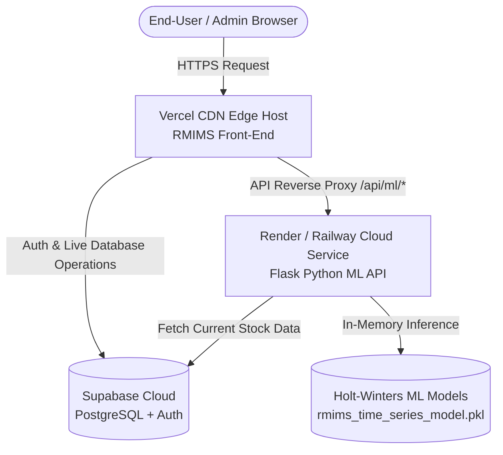

# RMIMS: Comprehensive System Audit & Cloud Deployment Blueprint

---

## 1. Executive Summary & System Deployment Status

| System Component | Technology Stack | Local / Operational Status | Cloud / Vercel Status |
| :--- | :--- | :--- | :--- |
| **Front-End Website** | Vanilla ES6 Modules, Vite 6.2, HTML5, CSS3, Chart.js | **Healthy & Verified** (Bundles clean via `npm run build` in 5.16s) | ❌ **Not Deployed to Vercel** (No `.vercel` project link or `vercel.json` found) |
| **Database & Auth** | Supabase Cloud (PostgreSQL, Row Level Security, Auth, Edge Functions) | **Live & Connected** (`hgandqozgcpytxebhvtn.supabase.co`) | ✅ **Cloud-Hosted on Supabase** |
| **ML Backend API** | Python Flask, CORS, `supabase-py` REST API | **Healthy** (All endpoints return HTTP 200) | ❌ **Localhost Only** (`http://127.0.0.1:5000`) |
| **ML Models** | Holt-Winters Exponential Smoothing (`rmims_time_series_model.pkl`, 3.68 MB) | **Trained & Verified** (27 materials + `OVERALL_TOTAL`) | ❌ **Packaged Locally** |

---

## 2. In-Depth Component Audit

### 2.1. Front-End Website (RMIMS UI & Portals)
- **Framework & Bundler**: Vite 6.2 managing a Multi-Page Application (MPA) written in pure ES6 JavaScript and Vanilla CSS.
- **Entry Points & Pages**:
  - **Public & Authentication**:
    - Landing page: [RMIMS/index.html](file:///c:/Users/Zeanna/Downloads/RMIMS-AI-BASED-FORECASTING-INTEGRATED/RMIMS-DASHBOARD-VIEW-3D-SUGAR-APPLIED/RMIMS-Supabase-ML-Forecasting-Integration/RMIMS/index.html)
    - Administrator login: [RMIMS/login.html](file:///c:/Users/Zeanna/Downloads/RMIMS-AI-BASED-FORECASTING-INTEGRATED/RMIMS-DASHBOARD-VIEW-3D-SUGAR-APPLIED/RMIMS-Supabase-ML-Forecasting-Integration/RMIMS/login.html)
    - User sign-in: [RMIMS/user-signin.html](file:///c:/Users/Zeanna/Downloads/RMIMS-AI-BASED-FORECASTING-INTEGRATED/RMIMS-DASHBOARD-VIEW-3D-SUGAR-APPLIED/RMIMS-Supabase-ML-Forecasting-Integration/RMIMS/user-signin.html)
    - Portal directory: [RMIMS/portal.html](file:///c:/Users/Zeanna/Downloads/RMIMS-AI-BASED-FORECASTING-INTEGRATED/RMIMS-DASHBOARD-VIEW-3D-SUGAR-APPLIED/RMIMS-Supabase-ML-Forecasting-Integration/RMIMS/portal.html)
  - **Admin Suite (7 Modules)**:
    - [RMIMS/admin/dashboard.html](file:///c:/Users/Zeanna/Downloads/RMIMS-AI-BASED-FORECASTING-INTEGRATED/RMIMS-DASHBOARD-VIEW-3D-SUGAR-APPLIED/RMIMS-Supabase-ML-Forecasting-Integration/RMIMS/admin/dashboard.html) & [RMIMS/js/dashboard.js](file:///c:/Users/Zeanna/Downloads/RMIMS-AI-BASED-FORECASTING-INTEGRATED/RMIMS-DASHBOARD-VIEW-3D-SUGAR-APPLIED/RMIMS-Supabase-ML-Forecasting-Integration/RMIMS/js/dashboard.js)
    - [RMIMS/admin/forecasting.html](file:///c:/Users/Zeanna/Downloads/RMIMS-AI-BASED-FORECASTING-INTEGRATED/RMIMS-DASHBOARD-VIEW-3D-SUGAR-APPLIED/RMIMS-Supabase-ML-Forecasting-Integration/RMIMS/admin/forecasting.html) & [RMIMS/js/forecasting.js](file:///c:/Users/Zeanna/Downloads/RMIMS-AI-BASED-FORECASTING-INTEGRATED/RMIMS-DASHBOARD-VIEW-3D-SUGAR-APPLIED/RMIMS-Supabase-ML-Forecasting-Integration/RMIMS/js/forecasting.js)
    - [RMIMS/admin/inventory.html](file:///c:/Users/Zeanna/Downloads/RMIMS-AI-BASED-FORECASTING-INTEGRATED/RMIMS-DASHBOARD-VIEW-3D-SUGAR-APPLIED/RMIMS-Supabase-ML-Forecasting-Integration/RMIMS/admin/inventory.html) & [RMIMS/js/inventory.js](file:///c:/Users/Zeanna/Downloads/RMIMS-AI-BASED-FORECASTING-INTEGRATED/RMIMS-DASHBOARD-VIEW-3D-SUGAR-APPLIED/RMIMS-Supabase-ML-Forecasting-Integration/RMIMS/js/inventory.js)
    - [RMIMS/admin/material-activity.html](file:///c:/Users/Zeanna/Downloads/RMIMS-AI-BASED-FORECASTING-INTEGRATED/RMIMS-DASHBOARD-VIEW-3D-SUGAR-APPLIED/RMIMS-Supabase-ML-Forecasting-Integration/RMIMS/admin/material-activity.html) & [RMIMS/js/material-activity-admin.js](file:///c:/Users/Zeanna/Downloads/RMIMS-AI-BASED-FORECASTING-INTEGRATED/RMIMS-DASHBOARD-VIEW-3D-SUGAR-APPLIED/RMIMS-Supabase-ML-Forecasting-Integration/RMIMS/js/material-activity-admin.js)
    - [RMIMS/admin/analytics.html](file:///c:/Users/Zeanna/Downloads/RMIMS-AI-BASED-FORECASTING-INTEGRATED/RMIMS-DASHBOARD-VIEW-3D-SUGAR-APPLIED/RMIMS-Supabase-ML-Forecasting-Integration/RMIMS/admin/analytics.html) & [RMIMS/js/analytics.js](file:///c:/Users/Zeanna/Downloads/RMIMS-AI-BASED-FORECASTING-INTEGRATED/RMIMS-DASHBOARD-VIEW-3D-SUGAR-APPLIED/RMIMS-Supabase-ML-Forecasting-Integration/RMIMS/js/analytics.js)
    - [RMIMS/admin/reports.html](file:///c:/Users/Zeanna/Downloads/RMIMS-AI-BASED-FORECASTING-INTEGRATED/RMIMS-DASHBOARD-VIEW-3D-SUGAR-APPLIED/RMIMS-Supabase-ML-Forecasting-Integration/RMIMS/admin/reports.html) & [RMIMS/js/reports.js](file:///c:/Users/Zeanna/Downloads/RMIMS-AI-BASED-FORECASTING-INTEGRATED/RMIMS-DASHBOARD-VIEW-3D-SUGAR-APPLIED/RMIMS-Supabase-ML-Forecasting-Integration/RMIMS/js/reports.js)
    - [RMIMS/admin/settings.html](file:///c:/Users/Zeanna/Downloads/RMIMS-AI-BASED-FORECASTING-INTEGRATED/RMIMS-DASHBOARD-VIEW-3D-SUGAR-APPLIED/RMIMS-Supabase-ML-Forecasting-Integration/RMIMS/admin/settings.html) & [RMIMS/js/settings.js](file:///c:/Users/Zeanna/Downloads/RMIMS-AI-BASED-FORECASTING-INTEGRATED/RMIMS-DASHBOARD-VIEW-3D-SUGAR-APPLIED/RMIMS-Supabase-ML-Forecasting-Integration/RMIMS/js/settings.js)
    - [RMIMS/admin/user-management.html](file:///c:/Users/Zeanna/Downloads/RMIMS-AI-BASED-FORECASTING-INTEGRATED/RMIMS-DASHBOARD-VIEW-3D-SUGAR-APPLIED/RMIMS-Supabase-ML-Forecasting-Integration/RMIMS/admin/user-management.html) & [RMIMS/js/user-management.js](file:///c:/Users/Zeanna/Downloads/RMIMS-AI-BASED-FORECASTING-INTEGRATED/RMIMS-DASHBOARD-VIEW-3D-SUGAR-APPLIED/RMIMS-Supabase-ML-Forecasting-Integration/RMIMS/js/user-management.js)
  - **User Suite (6 Modules)**:
    - [RMIMS/user/dashboard.html](file:///c:/Users/Zeanna/Downloads/RMIMS-AI-BASED-FORECASTING-INTEGRATED/RMIMS-DASHBOARD-VIEW-3D-SUGAR-APPLIED/RMIMS-Supabase-ML-Forecasting-Integration/RMIMS/user/dashboard.html), [RMIMS/user/inventory.html](file:///c:/Users/Zeanna/Downloads/RMIMS-AI-BASED-FORECASTING-INTEGRATED/RMIMS-DASHBOARD-VIEW-3D-SUGAR-APPLIED/RMIMS-Supabase-ML-Forecasting-Integration/RMIMS/user/inventory.html), [RMIMS/user/material-activity.html](file:///c:/Users/Zeanna/Downloads/RMIMS-AI-BASED-FORECASTING-INTEGRATED/RMIMS-DASHBOARD-VIEW-3D-SUGAR-APPLIED/RMIMS-Supabase-ML-Forecasting-Integration/RMIMS/user/material-activity.html), [RMIMS/user/analytics.html](file:///c:/Users/Zeanna/Downloads/RMIMS-AI-BASED-FORECASTING-INTEGRATED/RMIMS-DASHBOARD-VIEW-3D-SUGAR-APPLIED/RMIMS-Supabase-ML-Forecasting-Integration/RMIMS/user/analytics.html), [RMIMS/user/reports.html](file:///c:/Users/Zeanna/Downloads/RMIMS-AI-BASED-FORECASTING-INTEGRATED/RMIMS-DASHBOARD-VIEW-3D-SUGAR-APPLIED/RMIMS-Supabase-ML-Forecasting-Integration/RMIMS/user/reports.html), [RMIMS/user/settings.html](file:///c:/Users/Zeanna/Downloads/RMIMS-AI-BASED-FORECASTING-INTEGRATED/RMIMS-DASHBOARD-VIEW-3D-SUGAR-APPLIED/RMIMS-Supabase-ML-Forecasting-Integration/RMIMS/user/settings.html).
- **Communication Layer**:
  - Direct database access through `@supabase/supabase-js` v2 CDN with persistent session authentication.
  - Dynamically resolves ML backend base URL via `getApiBase()`: checks relative `/api/ml/status`, falls back to `http://127.0.0.1:5000` during local development, or relative proxy path in production.

> [!WARNING]
> **Vercel Routing Requirement**: In [vite.config.js](file:///c:/Users/Zeanna/Downloads/RMIMS-AI-BASED-FORECASTING-INTEGRATED/RMIMS-DASHBOARD-VIEW-3D-SUGAR-APPLIED/RMIMS-Supabase-ML-Forecasting-Integration/vite.config.js), Rollup input pages are located under the `RMIMS/` directory, outputting HTML files to `dist/RMIMS/index.html`. Deploying to Vercel without a `vercel.json` rewrite will cause root URL visits (`/`) to return a `404 Not Found`. A `vercel.json` configuration must be provided.

---

### 2.2. Supabase Backend Infrastructure
- **Cloud Database**: PostgreSQL hosted at `https://hgandqozgcpytxebhvtn.supabase.co`.
- **Schema & Security**:
  - `raw_materials`: Tracks material items, stock levels, minimum thresholds, and lead times.
  - `material_disbursements`: Historical usage, batch disbursements, timestamps.
  - `user_profiles`: User roles (`admin` vs `user`), full names, email, and active status.
  - Row Level Security (RLS) policies restrict mutations to authenticated admin/user roles.
- **Edge Functions**:
  - [supabase/functions/admin-create-user](file:///c:/Users/Zeanna/Downloads/RMIMS-AI-BASED-FORECASTING-INTEGRATED/RMIMS-DASHBOARD-VIEW-3D-SUGAR-APPLIED/RMIMS-Supabase-ML-Forecasting-Integration/supabase/functions/admin-create-user): Privileged administrative user account creation.

---

### 2.3. Python ML Backend API (`ml_backend/app.py`)
- **Framework**: Flask with `Flask-CORS` for cross-origin requests.
- **Endpoints Matrix**:
  | Method | Route | Description |
  | :--- | :--- | :--- |
  | `GET` | `/health`, `/api/health`, `/api/ml/status` | Model registry health check (verifies all 27 models loaded). |
  | `GET` | `/api/materials`, `/api/ml/materials` | Metadata catalog of supported materials, IDs, and measurement units. |
  | `POST` | `/api/forecast` | Dynamic forward forecasting with parameterized horizon (`day`, `week`, `month`, `year`). |
  | `GET/POST` | `/api/ml/forecast/<material>` | 7-day operational and 28-day monthly planning requirement forecast. |
  | `GET/POST` | `/api/ml/forecast/<material>/inventory` | Live inventory stock vs. forecasted requirement comparison with automated decision-support insights (Shortage / Excess / Reorder recommendation). |
  | `GET/POST` | `/api/forecast/comparison` | 2021–2025 actual historical used stock vs. 2026 forecast with $\pm 10\%$ acceptance bounds. |

---

### 2.4. Machine Learning Model (`rmims_time_series_model.pkl`)
- **File Size**: 3.68 MB.
- **Algorithm**: Holt-Winters Exponential Smoothing (`statsmodels.tsa.holtwinters.ExponentialSmoothing`).
- **Scope**:
  - **27 Authoritative Raw Materials**: Chiton, Salt, Ground Pepper, Crushed Garlic, Spices, Cooking Oil, Shrimp, Garlic, Onion, Spring Onion, Cabbage, Carrots, Bell Pepper, Soy Sauce, Sesame Oil, Oyster Sauce, Chicken, Pork, Loaf Bread, Butter/Margarine, Sugar, Pork Skin, Raw Bananas, Turmeric Powder, Water, Peanuts, Sea Salt, Honey.
  - **1 Aggregate Model**: `OVERALL_TOTAL` for macro-level demand planning.
- **Operational Verification**:
  - Tested in-memory unpickling with backward-compatibility patch for SciPy 1.18+.
  - Verification test completed: `Loaded 27 models, HTTP 200 OK, Sugar forecast status: success`.

---

## 3. End-to-End Cloud Deployment Architecture

To ensure high availability, zero CORS errors, and unified domain access, the system uses a decoupled hosting model:



---

## 4. Step-by-Step Production Deployment Guide

### Phase 1: Deploy the Python ML Model Backend to Render / Railway

Because the ML model requires Python with heavy C-extensions (`numpy`, `scipy`, `pandas`, `statsmodels`), deploying to a containerized platform like **Render** or **Railway** ensures zero cold-start bottlenecks and full compatibility.

#### Step 1.1: Create `ml_backend/requirements.txt`
In `ml_backend/requirements.txt`:
```txt
flask>=3.0.0
flask-cors>=4.0.0
numpy>=1.26.0
pandas>=2.0.0
scipy>=1.11.0
statsmodels>=0.14.0
supabase>=2.0.0
gunicorn>=21.2.0
```

#### Step 1.2: Create `ml_backend/Procfile`
```txt
web: gunicorn app:app -b 0.0.0.0:$PORT --workers 2 --timeout 120
```

#### Step 1.3: Deploy to Render.com
1. Go to [Render.com Dashboard](https://dashboard.render.com/) and click **New +** $\rightarrow$ **Web Service**.
2. Connect your GitHub repository: `RMIMS-Supabase-ML-Forecasting-Integration`.
3. Configure the service settings:
   - **Name**: `rmims-ml-backend`
   - **Root Directory**: `ml_backend`
   - **Runtime**: `Python 3`
   - **Build Command**: `pip install -r requirements.txt`
   - **Start Command**: `gunicorn app:app -b 0.0.0.0:$PORT --workers 2 --timeout 120`
4. Add Environment Variables:
   - `SUPABASE_URL`: `https://hgandqozgcpytxebhvtn.supabase.co`
   - `SUPABASE_KEY`: `[Your Supabase anon/publishable key]`
5. Click **Create Web Service**. Render will deploy the API and assign a public URL (e.g. `https://rmims-ml-backend.onrender.com`).
6. Verify deployment by visiting `https://rmims-ml-backend.onrender.com/api/health` in your browser.

---

### Phase 2: Configure & Deploy Front-End to Vercel

#### Step 2.1: Add `vercel.json` to Project Root
Create `vercel.json` in the root folder to route traffic and proxy ML API requests directly:

```json
{
  "buildCommand": "npm run build",
  "outputDirectory": "dist",
  "cleanUrls": true,
  "rewrites": [
    {
      "source": "/",
      "destination": "/RMIMS/index.html"
    },
    {
      "source": "/api/ml/:path*",
      "destination": "https://rmims-ml-backend.onrender.com/api/ml/:path*"
    },
    {
      "source": "/api/:path*",
      "destination": "https://rmims-ml-backend.onrender.com/api/:path*"
    },
    {
      "source": "/forecast",
      "destination": "https://rmims-ml-backend.onrender.com/api/forecast"
    },
    {
      "source": "/health",
      "destination": "https://rmims-ml-backend.onrender.com/health"
    }
  ]
}
```

> [!TIP]
> Replacing `https://rmims-ml-backend.onrender.com` in `vercel.json` with your actual Render/Railway URL ensures that all browser requests to `/api/*` are reverse-proxied seamlessly without triggering browser CORS policies.

#### Step 2.2: Deploy on Vercel
1. Go to [Vercel Dashboard](https://vercel.com/dashboard) and click **Add New...** $\rightarrow$ **Project**.
2. Select your GitHub repository: `calusinzeanna3-design/RMIMS-Supabase-ML-Forecasting-Integration`.
3. Configure project settings:
   - **Framework Preset**: `Vite`
   - **Root Directory**: `./`
   - **Build Command**: `npm run build`
   - **Output Directory**: `dist`
4. Add Environment Variables:
   - `VITE_SUPABASE_URL`: `https://hgandqozgcpytxebhvtn.supabase.co`
   - `VITE_SUPABASE_ANON_KEY`: `[Your Supabase anon/publishable key]`
5. Click **Deploy**. Vercel will build the project and provide your live production domain (e.g., `https://rmims.vercel.app`).

---

## 5. Post-Deployment Verification Checklist

- [ ] **Front-End Root Navigation**: Navigating to `https://<your-app>.vercel.app/` renders the RMIMS Landing Page.
- [ ] **Admin & User Auth**: Logging in with an admin or user account redirects to the proper dashboard (`/RMIMS/admin/dashboard.html` or `/RMIMS/user/dashboard.html`).
- [ ] **ML Health Check**: Visiting `https://<your-app>.vercel.app/api/health` returns `status: "healthy"` and `models_loaded: 27`.
- [ ] **Forecasting Module**: Opening the Admin Forecasting page loads charts, historical comparisons, and 7-day/1-month dynamic projections with decision support cards.
- [ ] **Inventory Synchronization**: Updating raw material quantities in Supabase updates the decision support status on the next forecast refresh.
